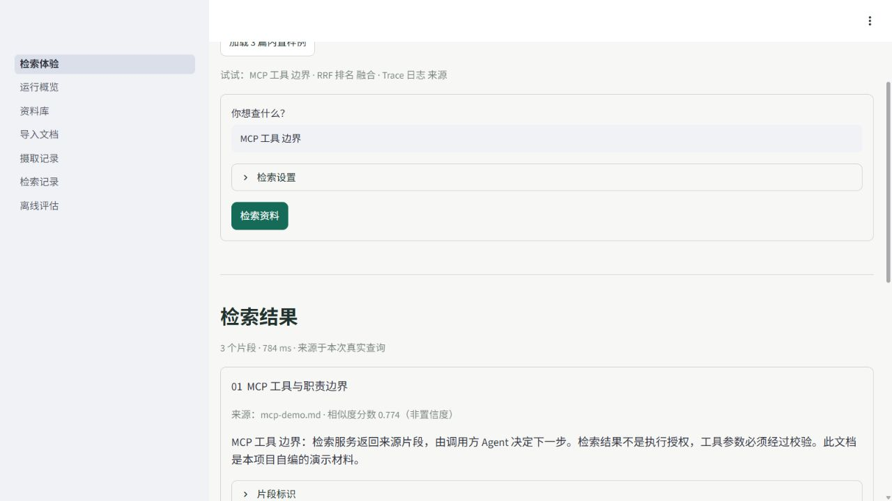

# Evidra RAG · 知锚检索

从技术文档中检索相关片段，返回原文和出处。可以在浏览器中查询，也可以通过 MCP 交给 Agent 调用。



浏览器页面用于查看检索结果，不生成聊天答案。下面的快速演示不需要模型或 API Key；
它使用 `local_hash` 验证查询流程，不能用来判断 Qwen3 的语义检索效果。

## 本地体验

需要 Python 3.12 和 uv：

```shell
git clone https://github.com/boombap777/evidra-rag.git
cd evidra-rag
uv sync --extra dev --frozen
uv run --no-sync python scripts/start_dashboard.py --demo --port 8503
```

打开 [检索页面](http://127.0.0.1:8503/)，点击“加载 3 篇内置样例”，搜索 `MCP 工具 边界`。
结果会显示片段、来源和本次查询耗时；摄取、索引管理与查询记录在侧边栏。
演示索引与模型索引分开存放，不会覆盖已有 Qwen3 索引。

## 检索策略怎么选

项目保留了 BM25、向量检索、RRF 融合和 Cross-Encoder 重排四条实验路径。
在固定的 Stack Overflow 基准上，Qwen3 向量检索的结果最好，因此模型配置默认使用 Dense，
没有把更复杂的组合直接当作升级。

500 条查询、14,613 篇文档，前 10 条结果的命中率如下：

| 方法 | HitRate@10 |
| --- | ---: |
| BM25 | 71.8% |
| Qwen3 Dense | **83.8%** |
| BM25 + Dense，经 RRF 融合 | 83.4% |
| RRF 后再重排 | 81.2% |

Dense 比 BM25 高 12.0 个百分点。完整指标、测试条件与复现入口见[检索实验](docs/benchmark-results.md)。
这些是已记录的离线实验结果，不是上方无模型页面的实时效果。

## 代码中值得看的部分

- **文档处理**：用户发起摄取后，依次完成解析、切分、向量化和入库；不会后台扫描个人文件。
- **检索配置**：Embedding、Splitter、VectorStore、Reranker 等组件通过接口和 YAML 配置替换，便于用同一数据集比较方案。
- **问题排查**：Trace 记录召回候选、排序变化和各阶段耗时，可以定位漏召回或重排效果下降的原因。

MCP 提供三个工具：`query_knowledge_hub` 查询片段、`list_collections` 列出集合、
`get_document_summary` 查看文档摘要。任务规划和后续动作由调用方 Agent 负责。

## 配置与测试

- [本地部署与 MCP 接入](LOCAL_DEPLOYMENT.md)
- [Qwen3 模型准备和完整基准复现](PUBLICATION.md#qwen3-与完整公开数据基准)
- [配置文件](config/settings.yaml) · [开发规格](DEV_SPEC.md)
- [自动化测试](https://github.com/boombap777/evidra-rag/actions)：本地运行 `uv run --no-sync pytest`；完整模型基准需另行准备依赖。

当前页面没有公网鉴权，只供本机使用。源码采用 [MIT](LICENSE)，模型、数据集和第三方依赖的许可见[第三方说明](THIRD_PARTY_NOTICES.md)。
